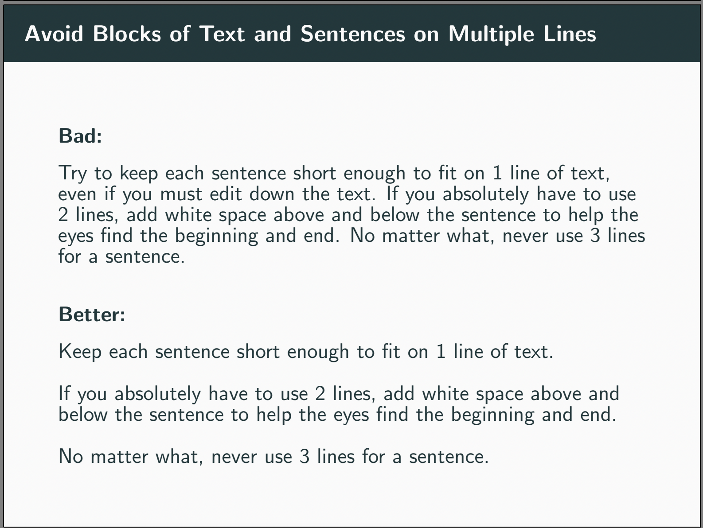

The following is advice for a hypothetical graduate student who is planning to present preliminary research in an academic environment. 

### Formatting of presentation slides

Here are a few general rules for formatting of presentation slides:

1. *Avoid blocks of text and sentences on multiple lines:* Try to keep each sentence short enough to fit on one line of text. This is because it is hard for the eyes to follow a sentence across multiple lines. If you must use 2 lines for a sentence, add white space above and below the sentence to help the eyes find the beginning and end. Never use 3 lines for a sentence. 
2. *In plots, use very large labels with clear units and helpful tick marks:* It is difficult to quickly understand a plot during a presentation. Help the audience by using overly large labels on the axes. Make sure the units of measurement are obvious. Place the tick marks on the axes to include major round numbers if possible. 
3. *Always explicitly write the main takeaway on each results slide:* If you show a plot or otherwise present results, you must state the main takeaway explicitly on the slide. If the point of your plot is that there is a linear relationship between the variables on the vertical and horizontal axes, write that explicitly underneath the plot. 

### Presenting a structural model

Here are a few rules specifically for presenting a structural model:

1. *Use the fewest number of symbols possible and choose memorable symbols:* Imagine being quickly shown 10 symbols, each with a distinct interpretation, then being tested on your memory of those symbols' interpretations 5 minutes later. Could you score 100% on this memory test? Probably not. Your audience also cannot possibly be expected to memorize the interpretations of 10 symbols on the fly. Help the audience by using a small number of symbols and choosing symbols with memorable interpretations, e.g., use W to denote the wage.
2. *Explicitly motivate the structural model before jumping into any equations:* Presenting a structural model requires that the audience memorize not only a list of symbols but also various functional forms and how they interact with one another. This is quite taxing on the audience and they will be justifiably upset if it is all for nothing. Thus, before launching into the model equations, you must convince the audience that the model is strictly necessary. Give a clear example of a result that the audience should be interested in but that cannot possibly be reached without a structural model.
3. *Each functional form must be explicitly justified:* It is trivial to write down an arbitrary set of structural equations and claim they represent the economy. It is the presenter's job to convince the audience that they picked a realistic set of structural equations. Provide empirical evidence that the equations are correct, or at least references to well-known papers that used the exact same equations previously.

### Interacting with the audience

Here are a few rules for dealing with questions from the audience:

1. *Write down audience questions:* The goal of presenting preliminary work is to receive feedback from the audience. It is unlikely the presenter will perfectly remember 20 questions and comments after the presentation. Either write down notes during the presentation or ask a friend to do so. 
2. *Anticipate audience questions:* Most questions asked by the audience during a presentation are predictable beforehand. Prepare by writing out clear and concise answers to any questions you expect to receive, even if doing so requires producing new results.
3. *Answers to empirical questions should be available on a slide:* Do not try to answer empirical questions off the top of your head. Any numbers quoted to the audience should be visible on a slide, perhaps in a plot or table.
4. *The best answer to some questions is "I don't know":* If answering a question requires deriving new analytical results off the top of your head, the best answer is often "I don't know for sure, but I will work on it after the talk and get back to you". 
5. *Take "bad" questions seriously:* Every so often, an audience member asks a "bad" question, which is a question whose answer is obvious or irrelevant to the current presentation. Rather than dismissing such questions, learn from them. How could the presentation be improved to avoid confusion next time?

### Additional advice:

Here are additional resources about presentations (repeating many of the points above):

- [Paul Goldsmith-Pinkham's advice on slides](https://github.com/paulgp/beamer-tips/blob/master/slides.pdf).

